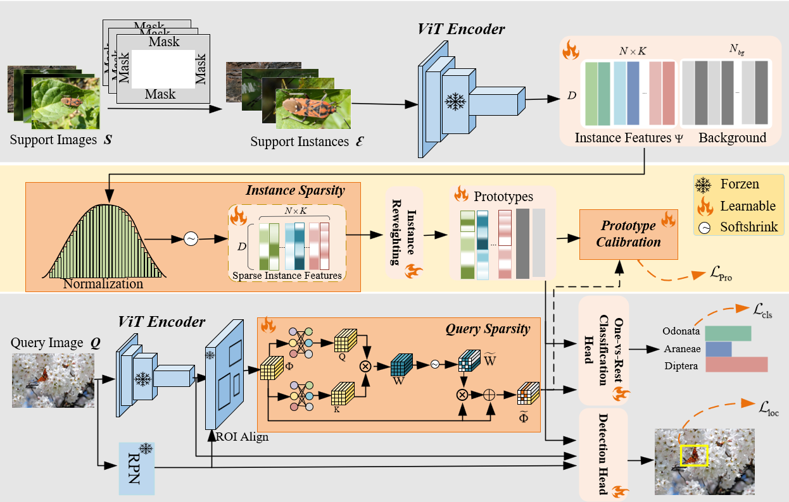
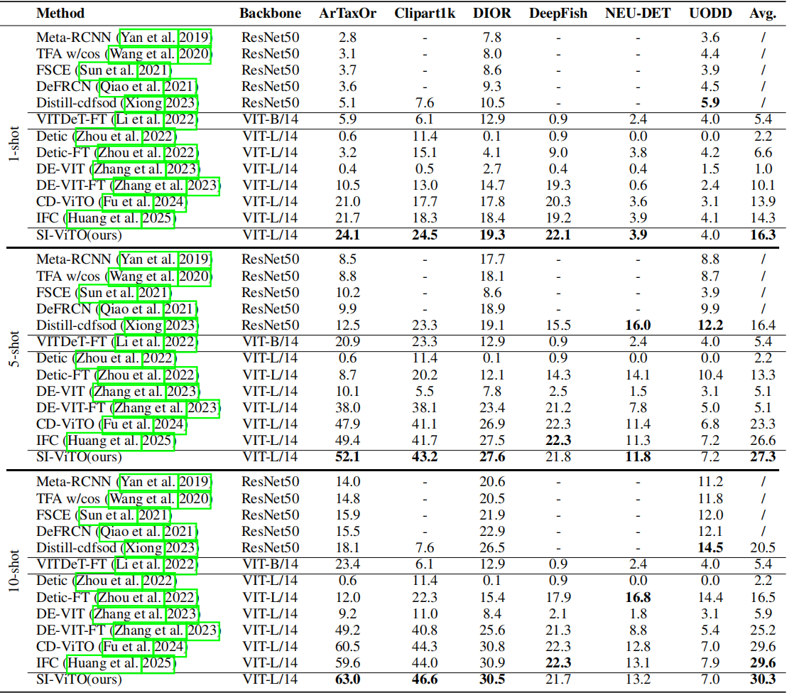
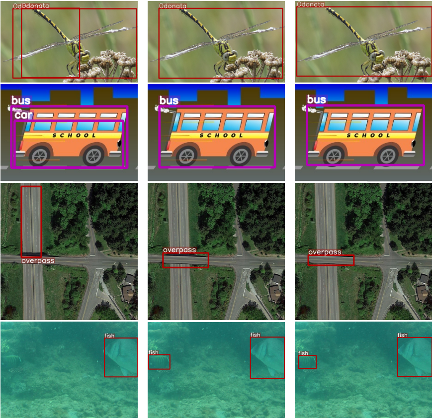

# Less is Better: Sparse Instance Learning for Few-Shot Object Detection

> [[Paper](xxxxxxxxx)] &emsp; [[Project Page](https://github.com/johnmaijer/Lesss-is-Better-Sparse-Instance-learning-for-few-shot-object-detection-)] &emsp; <br>
> Yali Huang, [Jie Mei](https://github.com/johnmaijer), Ziyi Wu, Yiming Yang, Hongru Zhao, Mingyuan Jiu, Hichem Sahbi <br>
> ZhengZhou University, School of Computer and Artificial Intelligence, Zhengzhou University <br>
> Engineering Research Center of Intelligent Swarm Systems, Ministry of Education
> Sorbonne University

---
## 🧠Overview
**In this Paper**, We:
1) We introduce a **dual sparsity mechanism** that applies instance feature sparsification not only to few-shot support images but also to query images. This enables the model to retain salient foreground semantics while effectively filtering out redundant and noisy
features, thereby alleviating overfitting and enhancing robustness in low-data scenarios.
2) We develop a dynamic prototype calibration strategy to refine class prototypes using query instances during adaptation. This accelerates prototype alignment to the target domain and significantly improves detection accuracy under few-shot constraints.
3) Extensive experiments conducted on multiple CD-FSOD benchmarks demonstrate that SI-ViTO significantly
outperforms state-of-the-art methods, confirming that leveraging sparse and discriminative representations, rather than
abundant redundant features, lead to superior performance in cross-domain few-shot detection.

**In this repo**, we provide: 
1) links and splits for target datasets;
2) codes for our SI-ViTO method.
---
## 🧠Method

## 🛠️ Environment Setup

An anaconda environment is suggested, take the name "cdfsod" as an example:

```
git clone git@github.com:johnmaijer/Lesss-is-Better-Sparse-Instance-learning-for-few-shot-object-detection-.git
conda create -n cdfsod python=3.9
conda activate cdfsod
pip install -r Lesss-is-Better-Sparse-Instance-learning-for-few-shot-object-detection/requirements.txt 
pip install -e ./Lesss-is-Better-Sparse-Instance-learning-for-few-shot-object-detection
cd Lesss-is-Better-Sparse-Instance-learning-for-few-shot-object-detection
```

## 📂 Dataset Preparation

The target datasets could be easily downloaded in the following links: (If you use the datasets, please cite them properly, thanks.)
- [Dataset Link from Google Drive](https://drive.google.com/drive/folders/16SDv_V7RDjTKDk8uodL2ubyubYTMdd5q?usp=drive_link)
- [Dataset Link from 百度云盘](https://pan.baidu.com/s/1MpTwmJQF6GtmnxauVUPNAw?pwd=ni5j)

To train SI-ViTO on a custom dataset, please refer to DATASETS.md for detailed instructions.

## 🏋️ Training

To train the model: 

1. download weights: download pretrained model from [DE-ViT](https://github.com/mlzxy/devit/blob/main/Downloads.md).
2. download the CD-FSOD benchmark. Put them in ./Lesss-is-Better-Sparse-Instance-learning-for-few-shot-object-detection/datasets/
3. run script:

```
bash main_results.sh
```

pretrained model: [Google Drive](https://drive.google.com/file/d/1KfNnkM7SewMN6nroRSG-GNiuaEELx6EP/view?usp=drive_link)


## Acknowledgement

Our work is built upon [CD-ViTO](https://github.com/lovelyqian/CDFSOD-benchmark), and also we use the codes of [ViTDeT](https://github.com/ViTAE-Transformer/ViTDet), [Detic](https://github.com/facebookresearch/Detic) to test them under this new benchmark. Thanks for their work.
## 🔍 Inference & Evaluation

Run inference:

#### Evaluation






## 📄 Citation

If you use our method or codes in your research, please cite:

```
@inproceedings{fu2025ntire, 
  title={NTIRE 2025 challenge on cross-domain few-shot object detection: methods and results,
  author={Fu, Yuqian and Qiu, Xingyu and Ren, Bin and Fu, Yanwei and Timofte, Radu and Sebe, Nicu and Yang, Ming-Hsuan and Van Gool, Luc and others},
  booktitle={CVPRW},
  year={2025}
}
```


